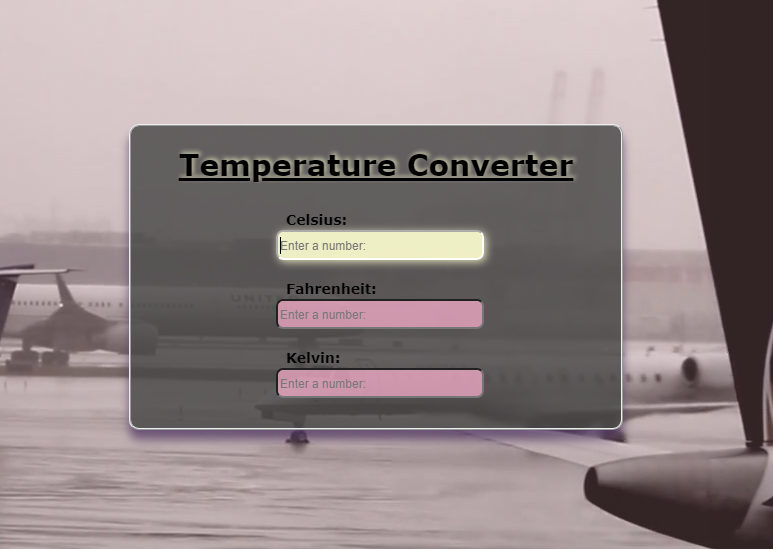

# Temterature converter web application
#### What has been implemented:
* my first micro webApp based on HTML, CSS adn JavaScript
* with elementary logic behind
* a loop video is used to the background
* a simple markup and a few style
* understandable JS code
* it's all simple and trivial
* click here => [_**Temterature converter**_](https://bakna2t.github.io/apptemp/)
___
